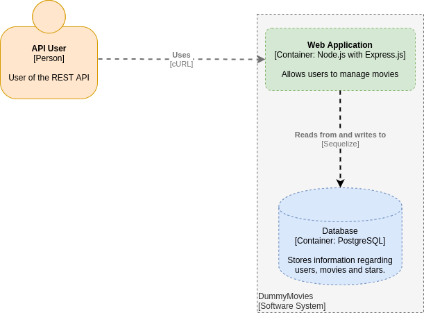

# Dummy Movies REST API written with Node.JS

This web application allows users to manage movie records. A C4 container diagram may be represented in this way:

## REQUIREMENTS
* NodeJS v14+
* Docker v20+
* Docker Compose v1.28+

## RUN DEVELOPMENT VERSION
1. npm run docker:up
2. npm install
3. npm run migrate
4. npm run nodemon

## RUN IN CONTAINER
1. create .env file in project root directory (it could be empty)
2. npm run docker:dev:up
3. npm run migrate

## NPM SCRIPTS
* `lint` - runs eslint for: lib/, migrations/, app.js
* `nodemon` - runs app with nodemon
* `docker:dev:up` - starts app and infrastructure using docker-compose
* `docker:dev:down` - stops docker-compose from "docker:dev:up"
* `docker:up` - starts infrastructure (db, adminer) using docker-compose
* `docker:down` - stops docker-compose from "docker:up"
* `start` - runs app with node (NODE_ENV=production)
* `migrate` - runs sequelize migrations
